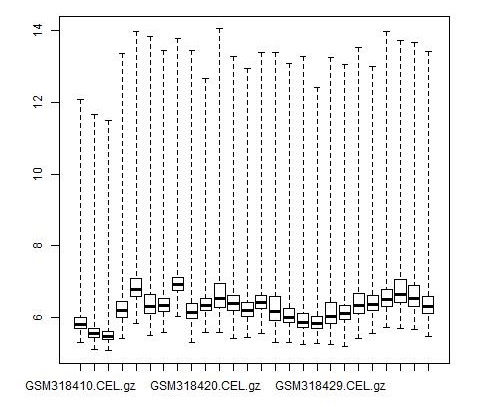
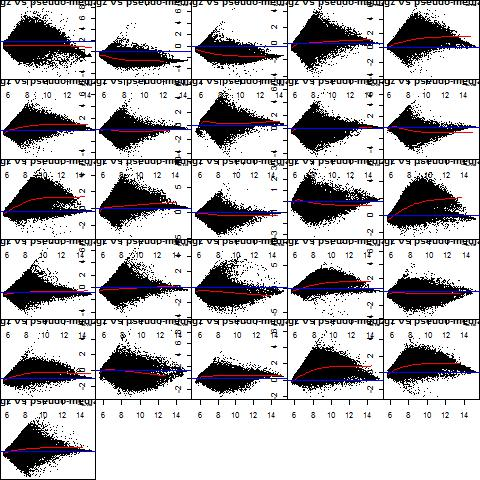
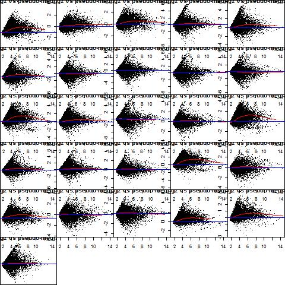
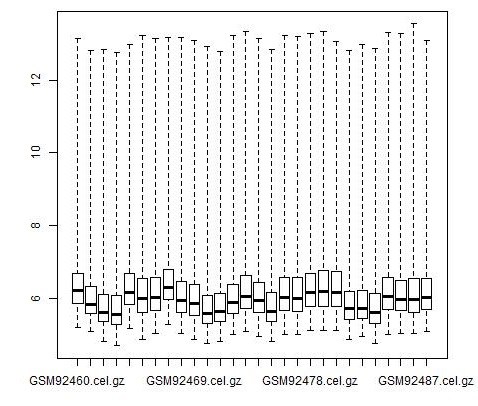
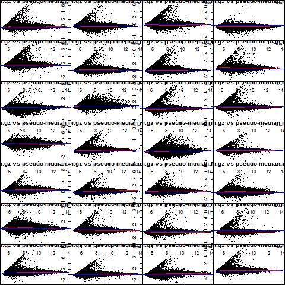
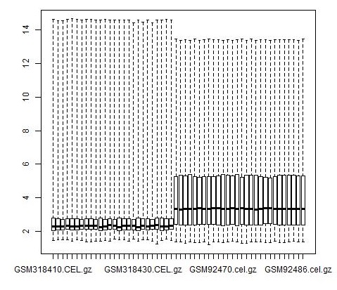
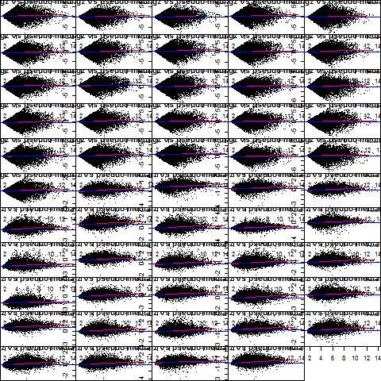
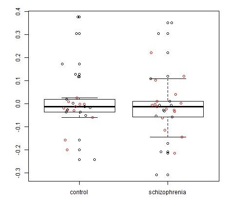
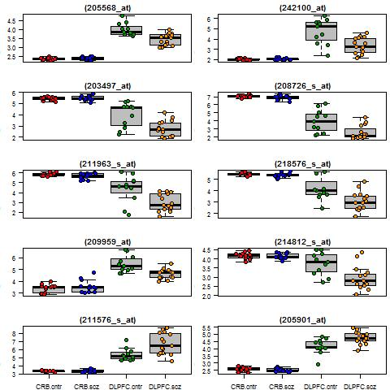

```{r setup, include=FALSE}
knitr::opts_chunk$set(echo = TRUE)
load('final_data.RData')
```

### Introduction

Schizophrenia (SCZ) is a mental illness that affects the brain function, particularly patient's thoughts, feelings, and behaviors[@TheNationalInstituteofMentalHealth2016]. The prevalence of SCZ is approximately 1%, however, it is positioned among the first five diseases leading the global disease burden[@Leucht2007]. Heritability is one of the principal risk factors for SCZ, accounting for almost 70% of the SCZ cases[@Hufner2015]. 

Genetic studies have identified differences in brain gene expression between schizophrenic patients and controls in genes involved in ion transport, cell proliferation and adhesion, and inflammatory response [@Harris2008]. However, the magnitude of the expression, as well as the direction of the difference, have shown some variability dependent on the body part and cell type [@Cattane2015].

This study aimed to compare the gene expression between humans with and without SCZ using postmortem brain cells from two different regions (dorsolateral prefrontal cortex and cerebellar cortex). The dorsolateral prefrontal cortex (DLPFC) is related to executive, emotional and behavioral functions. On the other hand, cerebellar cortex (CLC) is involved with motor control and some cognitive functions[@MayfieldBrainSpine2016].


### Methods

#### Data

This study is a secondary analysis using two different datasets publicly available in the NCBI Gene Expression Omnibus (GEO) database. The record for the DLPFC data is GDS3502. This dataset has information on 16 cases and 11 controls. The Affymetrix human genome U133 plus 2.0 array was used to measure the gene expression. Results using this dataset were published for Harris et al. (2008)[@Harris2008]. The second dataset, with cerebellar cells, is the record GDS1917. It has data of 14 schizophrenic patients and 14 controls. The same type of array as in the first dataset was used to get the gene expression, and there is not any publication available using this dataset. Raw CEL data was download to guaranty the same process for data management and cleaning. Raw data for GDS3502 was available in GSE12679, and in GSE4036 for the GDS1917 dataset.

#### Data pre-processing

Quality control assesment, for each dataset, was performed using arrayQualityMetrics package. Normalization and summarization were performed in two steps. First, each dataset was normalized and summarized using the robust multichip average (RMA) method, using quantile normalization, RMA background correction and median polish summarization. Logarithm (base 2) transformation was performed. Boxplots and MA plots were used to check the normalization process. Second, the normalized datasets were merged and a normalized using quantile normalization.

Since data came from two different datasets, the batch effect was assessed and corrected using ComBat function for known batch (brain part). To assess for unknown batch effects, sva function was used. Principal component analysis (PCA) was used to visualize the data before and after batch effect correction, to improve batch effect assessment and the necessity to control for batch variables in the subsequent analyzes. Moreover, two different hierarchical clustering methods (average and complete linkage) to cluster top 10% of the most highly variable genes before-after batch correction. 

#### Statistical analysis

A Bayesian moderated two-way test was applied to identify differentially expressed genes as implemented in LIMMA package. Schizophrenia status was the first factor for the analysis, as a second factor, the brain part was considered to control by the batch effect. The tested contrasts assessed which genes have a differential expression in patients with SCZ in DLPFC cells,  which genes have a differential expression in patients with SCZ in cerebellar cells, and which genes respond differently in DLPFC compared to cerebellar cells. First, filtering procedure was performed using the nsFilter function to reduce the number of comparisons and increase power.  Features without an Entrez Gene ID annotation or mapping the same gene; without annotation to at least one GO term in the BP, CC or MF ontology; genes with an interquartile range (IQR) in the lower 50% of the IQR distribution; and Affymetrix control probes were deleted. Raw p-values were adjusted for multiple hypothesis testing using the false discovery rate (FDR) method of Benjamini and Hochberg (BH). 

Two complementary approaches to functional enrichment analysis were employed. First, a GSEA algorithm by chromosome using Fisher's exact test with BH correction was performed to identify whether any chromosomes were significantly enriched or depleted for differentially expressed genes. In addition, the topGO package was used to implement the enrichment analysis by "biological process" using the categories defined by the Gene Ontology consortium (GO). The over-representation of GO terms within the group of differentially expressed genes terms was performed using Fisher's exact test. All data management and statistical analysis were performed in R (Version 3.4.2RC)[@RCoreTeam2017], using a significance level of 0.05.


### Results

Sixteen SCZ cases and 11 controls were obtained from GDS3502, and 14 SCZ cases and 14 control from GSE1917, for a total of 30 cases and 25 controls. Quality control assessment for GDS3502 data is in Appendix 1. Boxplots in Figure 4 show that arrays 6 and 9 seem to have a different distribution as compared with others, also their distribution shows more variability. Figure 6 shows that array 9 is a little bit shifted but it is not strong. Other tools of quality control assessment did not show any irregularity that cannot be corrected by normalization. However, Figure 16 shows a yellow spot for array 2 that can be an effect of some laboratory issue, as contamination. Then, array 2, corresponding to a schizophrenic patient, was excluded. 

Quality control assessment for GSE1917 data is in Appendix 2. No critical issues in quality are shown in the arrayQualityMetrics report, other than some difference in variability in the distributions (Figure 4). However, this minor problem can be corrected with normalization.

Figures 1 and 5 show the boxplots for gene expression before normalization in both datasets. We can see the necessity of the normalization process. Figures 3 and 7 show the same boxplots after normalizing the data; now the boxplots look aline. Also, when comparing the MA plots before (Figures 2 and 6) and after normalizing (Figures 4 and 8), we can see the improvement in the comparability between samples. After merging the two datasets, boxplots in Figure 9 show the necessity to normalize the joined dataset. Figures 10 and 11 show the boxplot of the distribution of the expression by sample and the MA plots after normalizing the joined dataset. 

Since data came from two different datasets, the batch effect was assessed. Figure 14 (a) shows a PCA for the original dataset. As we can see, there is an evident clustering between the two datasets, black points are DLPFC, and red points are cerebellar, indicating a batch effect given by the brain part. ComBat correction, for known batch effect, was used on the joined dataset. As we can see in Figure 12, the coefficients do not show bias, and Figure 14 (b) shows that after the correction the data do not show a batch effect. Then, comparisons of gene expression between groups should be adjusted by brain part (DLPFC and cerebellar). Looking for unknown batch effect, the sva function was used. However, as we can see in Figure 13, no other unknown batch effects were detected.

Figures 15 and 16 show the differences in gene clustering, for the top 10% of the most highly variable genes, before and after batch correction using two different methods (average and complete linkage). The dendrograms after batch correction show a more clear clustering path between genes, with a within-cluster distances smaller as compared with those distances obtained using the data without batch effect removal. These findings confirm the necessity of controlling by brain part in the subsequent analyzes.

Of the total 54675 probes, 47617 were excluded by filtering procedure, resulting in a total of 7058 genes for the differential expression analysis. The main reasons for exclusion where duplicates mapping the same gene (37.6%), without Entrez Gene ID annotation (26.0%), and low variance (14.8%).

#### Differential expression and functional enrichment analysis

When testing which genes had a differential expression in patients with SCZ in cerebellar cells, no genes were identified. However, 28 genes had a differential expression in patients with SCZ in DLPFC cells (Table 1). Figure 17 shows the boxplots of top 10 differentially expressed genes between the conditions (SCZ and control). None of the genes showed a differential expression when comparing DLPFC cells and cerebellar cells. None chromosomes were significantly enriched or depleted for differentially expressed genes in DLPFC (Table 2). 

Figure 18 shows the pathway for the enrichment analysis by the biological process using GO. Rectangles indicate the five most significant terms, and the color represents the relative significance, darker means more significant. The plot shows for each node some basic information; particularly, the fourth line shows the number of significant genes, and the total number of genes annotated to the respective GO term. The five rectangles in Figure 18 are GO:002431 (3/53) "Fc receptor mediated", 0034314 (2/21) "Arp2/3 complex-media", 0007218 (2/28) "neuropeptide signaling", 0045010 (2/26) "actin nucleation", 0008643 (3/91) "carbohydrate transport".


### Discussion

In the present study, some gene alteration in DLPFC gene expression in schizophrenia patients was found. Most of the significant genes (21/28) had a lower expression as compared with the control group. It is essential to identify the functions that can be affected by these downregulated genes since the DLPFC area in the brain is related with emotional and behaviorl functions. Furthermore, some biological alterations were found, these alterations seem to be different to the reported by [@Harris2008] since they were looking for alteration in the molecular process, and the present study evaluated the biological processes.

This study did not found any chromosomes significantly enriched or depleted by the differentially expressed genes in DLPFC. Also, there were no differences in the gene expression when comparing DLPFC cells and cerebellar cells. However, this last finding is not concordant with the finding differences between SCZ and controls in DLPFC and not in the cerebellar region. This last issue might be caused by the fact that the brain region represents a batch effect.


### Tables

#### Table 1. Differential expressed genes in DLPFC cells comparing SCZ patients and controls 
```{r echo=FALSE}
library(DT)
tt2[,22:27] <- round(tt2[,22:27],4)
datatable(tt2[,c(3,22:27)])
```

#### Table 2. Chromosomes enrichement for differentially expressed genes in DLPFCD 
```{r echo=FALSE}
chromosomes[,2:3] <- round(chromosomes[,2:3],4)
chromosomes[,2] <- ifelse(chromosomes[,2]==1, ">0.999", chromosomes[,2])
chromosomes[,3] <- ifelse(chromosomes[,3]==1, ">0.999", chromosomes[,3])
datatable(chromosomes)
```


### Figures

#### Figure 1. Boxplot of DLPFC (GEO3502) expression before normalization 


#### Figure 2. MA plots of DLPFC (GEO3502) expression before normalization 


#### Figure 3. Boxplot of DLPFC (GEO3502) expression after normalization 


#### Figure 4. MA plots of DLPFC (GEO3502) expression after normalization 


#### Figure 5. Boxplot of cerebellar (GEO1917) expression before normalization 


#### Figure 6. MA plots of cerebellar (GEO1917) expression before normalization 


#### Figure 7. Boxplot of cerebellar (GEO1917) expression after normalization 


#### Figure 8. MA plots of cerebellar (GEO1917) expression after normalization 


#### Figure 9. Boxplot of complete dataset for expression before normalization 


#### Figure 10. Boxplot of complete dataset for expression after normalization 


#### Figure 11. MA plots of cerebellar (GEO1917) expression before normalization 


#### Figure 12. Histogram of coefficients after batch effect correction using ComBat and brain location as known bach effect 


#### Figure 13. Boxplot of results of batch effect correction using sva for unknown bach effect


#### Figure 14. PCA for gene expression before and after ComBat batch effect correction


#### Figure 15. Hierarchical clustering analysis using average linkage 


#### Figure 16. Hierarchical clustering analysis using complete linkage 


#### Figure 17. Boxplots of top 10 differentially expressed genes between control and scz groups


#### Figure 18. Enrichment analysis using Gene Ontology (GO) 


### Annexes

#### [Annex 1. Quality control assessment for GDS3502](./eset3502.qc/index.html)

#### [Annex 2. Quality control assessment for GDS1917](./eset1917.qc/index.html)

### References
